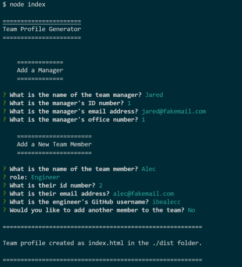
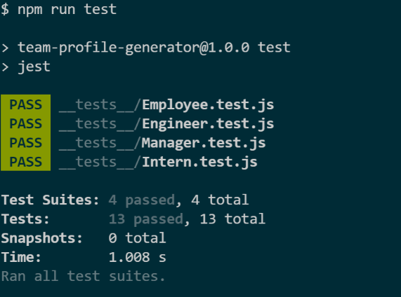

# Team Profile Generator
  

  ## Description
  A Node.js command-line application that takes in information about employees on a software engineering team and generates an HTML webpage that displays summaries for each person.

  ## Table of Contents
  * [Installation](#installation)
  * [Usage](#usage)
  * [Contributing](#contributing)
  * [Tests](#tests)
  * [License](#license)
  * [Questions](#questions)
  
  
  ## Installation
  Make sure you're in the root of the directory, and type `npm install`, or `npm i` in the terminal. 

  ## Usage  
Type `node index.js` or `node index` in the terminal. Answer the prompts, then check the /dist folder for the index.html file.    
    [Click here for video demo.](https://watch.screencastify.com/v/P1kjMCSU3WX8mj8enLSS)  

   

  ## Contributing
  If you wish to contribute to the project, please add my GitHub repo as a source.

  ## Tests
  Type `npm run test` in the terminal. 

  ## License

  The license for this project is MIT.

  ## Questions
  My Github Profile: [michaelwwalker42](https://github.com/michaelwwalker42)  
  For additional questions email me at michaelwwalker42@gmail.com  
